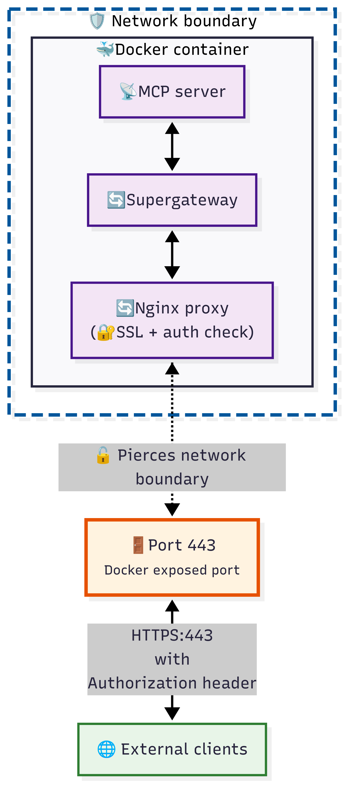
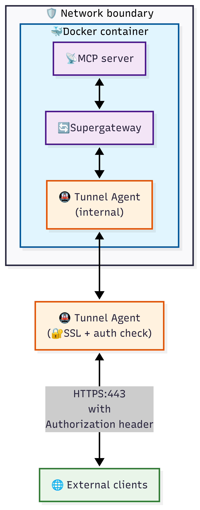

# How to Run Local MCP Servers Securely

Read this guide to understand why running MCP servers locally creates an abundance of severe security risks, and how to mitigate these risks with a simple mix of containerization (or sandboxing) and MCP server-network isolation. 

## 📚 Table of Contents
- [Introduction](#risks-of-running-mcp-servers-locally)
- [How to Use Docker to Sandbox and Securely Explose Local MCP Servers](#how-to-use-docker-to-sandbox-your-mcp-server-and-expose-it-securely)
- [Customize and Build Your MCP Server Docker Image](#customize-and-build-your-mcp-server-docker-image)
- [Conclusion](#conclusion)

## Risks of Running MCP Servers Locally

Locally running MCP servers have unlimited access to your personal files, creating risks of data exfiltration, virus implantation & propagation, or data encryption attacks  (Ransomware).

You should take precautions to make sure the MCP server you're running **doesn't have unfettered access to your local file system and / or corporate network.**

## Using Docker to Secure Local MCP Servers

One of the solutions you can use to run MCP servers more securely is Docker. [Docker](https://www.docker.com/get-started/) is a containerization solution that is free, open source, and widely supported across all major operating systems.

Running local MCP servers inside Docker containers allows you to run them in a sandboxed environment that you have complete control over. You decide which files and folders to expose to the container, can define rules for HTTP and WebSocket traffic, and selectively expose environment variables instead of unintentionally leaking secrets.

Running MCP servers inside Docker increases their security and gives you more control over what data and capabilities the server has access to.

Note that it's not a complete bulletproof solution, an MCP server running inside a docker container in your computer won't have access to your files, but it will be able to make network calls unless you lock down traffic from the container. **For maximum security,** you should containerize your MCP servers, and run them outside of your corporate / private network.

### Running MCP servers inside Docker containers solves 2 problems:

1. Data exfiltration via filesystem is blocked - the container cannot read host files unless users explicitely expose those files to it.
2. Accessing corporate network can be mitigated by running untrusted MCP servers outside of your corporate / private network.

This tiered list shows how to quickly assess the security of a locally deployed MCP server:

1. **Highest Security/Lowest Risk:** Running an MCP server outside corporate network with sandboxing.
2. **Medium security/Medium Risk:** Running an MCP server locally with sandboxing.
3. **Lowest security/Highest Risk:** Running an MCP server locally without sandboxing.

⬆️ [Jump to Contents](#-table-of-contents)

## How To Use Docker to Sandbox Your MCP Server and Expose It Securely	

> These are simplified steps to save you time, you can find more details on each of these steps below:
```bash
# TLDR:
#1. Copy your desired Dockerfile into the root of the project
#2. Setup environment variables in `.env` file
#3. Build docker image
npm run build
#4. Start docker image
npm run start
```

In order to help you run your containerized MCP servers, we've created three Docker files that allow you to launch and expose any Node JS MCP server securely (Python servers will follow later). Here are your three options:

1. [NGinx proxy](../docker/node_mcp/nginx_proxy/Dockerfile): By creating a self-signed SSL certificate, and using a combination of [NGinx](https://nginx.org/) with [Supergateway](https://github.com/supercorp-ai/supergateway), we can safely expose port 443 (HTTPS traffic), and protect it with a secret token.
2. [NGrok secure tunnel](../docker/ngrok_tunnel/nginx_proxy/Dockerfile): [NGrok](https://ngrok.com/) is an established leader in network security. They offer Secure Tunnel support with many methods of securing the connection, including Basic Auth, OAuth, OIDC, and JWTs. For our simple use case, we demonstrate how to secure the connection with [Basic Auth](https://ngrok.com/docs/agent/cli/#ngrok-http).
3. [Pinggy secure tunnel](../docker/pinggy_tunnel/nginx_proxy/Dockerfile): [Pinggy](https://pinggy.io/) is a smaller provider with a focused Security Tunnelling offering. Their pricing is lower, and the user interface is simpler and more intuitive to use than NGrok. While we were impressed with their web application, we cannot speak to their long-term performance or reliability.

## What are the differences between using NGinx proxy vs tunneling?

Both proxy and tunnelling approaches use the same core security model. Docker sandboxes the MCP server, and Supergateway exposes it via HTTP on port 8000, which is internal to the container and not exposed to the host. This means that you cannot connect to Supergateway directly, and traffic within the container can flow securely without encryption.

### NGinx Proxy

The [NGinx Dockerfile](../docker/node_mcp/nginx_proxy/Dockerfile) creates a self-signed SSL certificate, and launches a webserver that listens to traffic from port 443 (the HTTPS port), and forwards it along to port 8000 if the request is correctly authorized with a Bearer token (aka provides a `authorization: Bearer {SECRET_KEY}` header). This is the simplest and most cost-effective solution to secure your MCP servers, but it doesn't offer added benefits like logging and remote disconnect that a secure tunnel provides. 



### Secure Tunnel

A secure tunnel uses a combination of agents (one running inside the container, alongside your MCP server & Supergateway) and one on a remote data center. These agents connect on startup and form a tunnel that allows authorized traffic to enter the container. The Dockerfiles for secure tunnels work very similarly to NGinx, the only difference is that we don't need to open a port into the Docker container, since inbound traffic will always go to through the tunnel.

The [NGrok Dockerfile](../docker/node_mcp/ngrok_tunnel/Dockerfile) and [Pinggy Dockerfile](../docker/node_mcp/pinggy_tunnel/Dockerfile) launch the tunneling agents on startup, using environment variables to authenticate your connection to their service. The tunnel listens to traffic from port 443 (the HTTPS port) and forwards it along to port 8000 if the request is correctly authorized with Basic Auth for NGrok or Bearer Token for Pinggy (using `authorization: Bearer {SECRET_KEY}` header).



⬆️ [Jump to Contents](#-table-of-contents)

## Customize and Build Your MCP Server Docker Image

The first step will be to prepare your machine to build and run Docker images. Even if you plan to deploy the Docker image remotely, it may still be helpful to build and run it locally to ensure everything is working as you expect.

> Pro tip: If you're testing your MCP servers locally, disconnect from your corporate VPN (or from WiFi entirely) to avoid giving unintended access to your corporate/private network.

### Pre-requisites

1. Install [Docker Desktop](https://www.docker.com/products/docker-desktop/) on MacOS and Windows, or [Docker Engine](https://docs.docker.com/engine/install/ubuntu/) on Linux.
2. Install [Node](https://nodejs.org/) (used for helpful scripts and loading environment variables)

```bash
# install our single dependency: @dotenvx/dotenvx (used to read values from .env files)
npm install 
```

### Prepare the Environment Variables & Dockerfile

We recognize that learning Docker is a journey and can be intimidating for people unfamiliar with the technology. That's why we provide a basic CLI through NPM that largely abstracts away the complexity of dealing with Docker. 

Simply follow the steps below, and you'll be establishing secure connections to sandboxed local MCPs in no time.

> Pro tip: The command `npm run cli` prints the list of utility scripts our CLI provides. In addition, you can pass `-h` to any command to read documentation about its function and parameters, ex: `npm run build -- -h`

**Step 1:** Copy `.env.example` file at the root, and rename the copy to `.env`, you will place configuration and secrets here.

**Step 2:** Open `.env` file and assign values to the following environment variables (use `npm run gen_key` to generate secure secrets):

```bash
# (Required) The MCP server to run inside container
NPM_MCP="@modelcontextprotocol/server-filesystem"

# (Optional) Pass '--stateful' if your MCP server is stateful, otherwise leave empty
SUPERGATEWAY_EXTRA_ARGS="--stateful"

# (Required if using NGinx Proxy) Set this if you're using nginx proxy to secure your connection
NGINX_ACCESS_TOKEN="secret_key__please_change"

# (Required if using NGrok Secure Tunnel) Set this if you're using NGrok tunnel to secure your connection
NGROK_URL="example-url.ngrok.app"
NGROK_AUTHTOKEN="secret_key__please_change"
NGROK_BASIC_AUTH="user:password__please_change"

# (Required if using Pinggy Secure Tunnel) Set this if you're using Pinggy tunnel to secure your connection
PINGGY_ACCESS_TOKEN="secret_key__please_change"
PINGGY_BEARER_TOKEN="secret_key__please_change"
```

**Step 3:** Depending on which approach you want to take, select one of the 3 Dockerfiles we provide and place it at the root of this repository (replacing the existing Dockerfile, which is a copy of the [NGinx proxy Dockerfile](../docker/node_mcp/nginx_proxy/Dockerfile)):

- [NGinx proxy](../docker/node_mcp/nginx_proxy/Dockerfile)
- [NGrok secure tunnel](../docker/ngrok_tunnel/nginx_proxy/Dockerfile)
- [Pinggy secure tunnel](../docker/pinggy_tunnel/nginx_proxy/Dockerfile)

**Step 4:** Build the docker image: `npm run build`

**Step 5:** Start the docker image: `npm run start`

You can also start the docker image in "detached mode", which means it will run in the background and start automatically, ex:

```bash
# start normally (attached to a terminal)
npm run start
# start detached (run in the background, start automatically)
npm run start -- -d
# stop an MCP server launched in detached mode:
npm run stop
```

You can find the source code for the [build](../package_scripts/build.mjs) and [start](../package_scripts/start.mjs) scripts in the [infrastructure/package_scripts](../package_scripts/) directory. These simple scripts load up environment variables from the `.env` file, and forward them along to the respective Docker command (`docker build` & `docker run`).

### Technical Notes on Building Docker Images

If you can, base your Docker images from Alpine (ex: `FROM node:$NODE_VERSION-alpine`) which offers the smallest image size and therefore better security.

If you need `apt` package manager or run into compatibility issues, base your Docker images from Slim versions (ex: `node:$NODE_VERSION-slim`) which are usually Debian based and offer more utities and wider compatibility out of the box (for approx. 100MB more disk space consumed per docker image).

If all else fails, basing your Docker image from a widely popular Linux distro like Ubuntu (ex: `FROM ubuntu:latest`) and then installing your needed dependencies is a solid idea.

To give you an example of these decisions in action, we decided to base our NGinx Docker image from `node:$NODE_VERSION-alpine`, making it as compact and secure as possible. But we ran into challenges installing and running the NGrok and Pinggy applications in the Alpine image, so we switched those images to be based on `node:$NODE_VERSION-slim` instead, which fixed my compatability issues, but also resulted in a Docker image that is approximately 100 MB larger than the alpine version.

One final thing to note, is that you should **never access secrets** during the build stage of Dockerfiles. Any variables you access while building the Docker image become embedded in it. All secrets should be passed to the MCP server at runtime, which happens automatically when you run: `npm run start` 

### Testing and Debugging

Once you have an MCP server running inside a Docker container, you'll want to test connecting to it to ensure that everything is set up properly.

There are various MCP clients out there that help you diagnose connection issues. Our recommendation is to use [Postman](https://www.postman.com/downloads/), as its Desktop application offers a great MCP debugger.

Alternatively, you can try out MCP Inspector, which is an official tool from Anthropic to connect to and debug MCP servers:

```bash
# install MCP Inspector
npm install @modelcontextprotocol/inspector@latest -g
# run MCP Inspector
npx @modelcontextprotocol/inspector@latest
```

## Conclusion

You can sandbox almost any MCP server in minutes: pick a Dockerfile (start with the NGinx proxy for the simplest apporach), drop in the env vars, run build + start, then validate with Postman or the MCP Inspector.

Using a Docker container with a gateway/tunnel enhances security in two important ways: blocks unfettered file access and narrows the network surface. Reach for Ngrok or Pinggy only if you need hosted ingress, extra auth modes, or remote disconnect/logging.

Keep secrets out of image builds, only mount what you actually need, rotate tokens, and glance at logs now and then. Found a gap or have an idea? Open an issue or PR — we're looking forward to reading your feedback and / or suggestions.

From the [MCP Manager Team](https://mcpmanager.ai/) 

MCP Manager is a comprehensive, enterprise-level security solution for your MCP ecosystem.
