TODO:

Add a diagram demonstrating how the tunnel approach works:

```mermaid
graph BT
    subgraph BOUNDARY["🛡️ Network boundary"]
        subgraph DC["🐳Docker container"]
            TUNNEL_INT <--> SG["🔄Supergateway"]
            SG <--> MCP["📡MCP server"]
        end
    end

    TUNNEL_EXT <--> TUNNEL_INT["🚇 Tunnel Agent<br/>(internal)"]

    CLIENT["🌐 External clients"] <--->|HTTPS:443<br/>with<br/>Authorization header| TUNNEL_EXT["🚇 Tunnel Agent<br/>(🔐SSL + auth check)"]
    
    classDef container fill:#e1f5fe,stroke:#01579b,stroke-width:2px
    classDef internal fill:#f3e5f5,stroke:#4a148c,stroke-width:2px
    classDef external fill:#e8f5e8,stroke:#2e7d32,stroke-width:2px
    classDef tunnel fill:#fff3e0,stroke:#e65100,stroke-width:2px
    
    class DC container
    class MCP,SG,TUNNEL_INT internal
    class CLIENT,TUNNEL_EXT external
    class TUNNEL_EXT,TUNNEL_INT tunnel
```

Add a diagram demonstrating how the NGinx setup works:

```mermaid
flowchart BT
 subgraph BOUNDARY["🛡️ Network boundary"]
     subgraph DC["🐳Docker container"]
            SG["🔄Supergateway"]
            NGINX["🔄Nginx proxy<br>(🔐SSL + auth check)"]
            MCP["📡MCP server"]
      end
  end
    
    PORT["🚪Port 443<br><small>Docker exposed port</small>"]
    
    CLIENT["🌐 External clients"] <-- "HTTPS:443<br>with<br>Authorization header" --> PORT
    PORT <-.-> |"🔓 Pierces network boundary"| NGINX
    NGINX <--> SG
    SG <--> MCP

     CLIENT:::external
     PORT:::port
     NGINX:::internal
     SG:::internal
     MCP:::internal
    classDef container fill:#e1f5fe,stroke:#01579b,stroke-width:2px
    classDef internal fill:#f3e5f5,stroke:#4a148c,stroke-width:2px
    classDef external fill:#e8f5e8,stroke:#2e7d32,stroke-width:2px
    classDef port fill:#fff3e0,stroke:#e65100,stroke-width:3px

    style BOUNDARY fill:transparent,stroke:#01579b,stroke-width:3px,stroke-dasharray: 10 5
```

Notes on why run MCP servers inside docker:

1. Docker images can be run securely both locally on end users machines, as well as remotely on a server.
2. Docker images are easy to build and customize, and work across operating systems.
3. Docker provides a sandbox to contain MCPs, HTTPS + API tokens create secure connections into the sandbox.
4. Docker is built on OCI (Open Container Initiative), an open standard supported by Docker, Podman, and other competing implementations. This is similar to Model Context Protocol (MCP) itself, and 

Notes on Node CLI:

- Automatically injects build & runtime env variables from a .env file.
- Abstracts away the complexity of docker into simple commands: build, start & stop

Notes on docker images:

If you can, base your Docker images from Alpine (ex: `FROM node:$NODE_VERSION-alpine`) which offers the smallest image size and therefore highest security.

If you need `apt` package manager or run into compatibility issues, base your Docker images from Slim versions (ex: node:$NODE_VERSION-slim) which are usually Debian based and offer more utities and wider compatibility out of the box (for approx. 100MB more disk space consumed per docker imafe)

If all else fails, basing your docker image from a widely popular linux distro like Ubuntu (ex: `FROM ubuntu:latest`) and then installing your needed dependencies is a solid idea.

